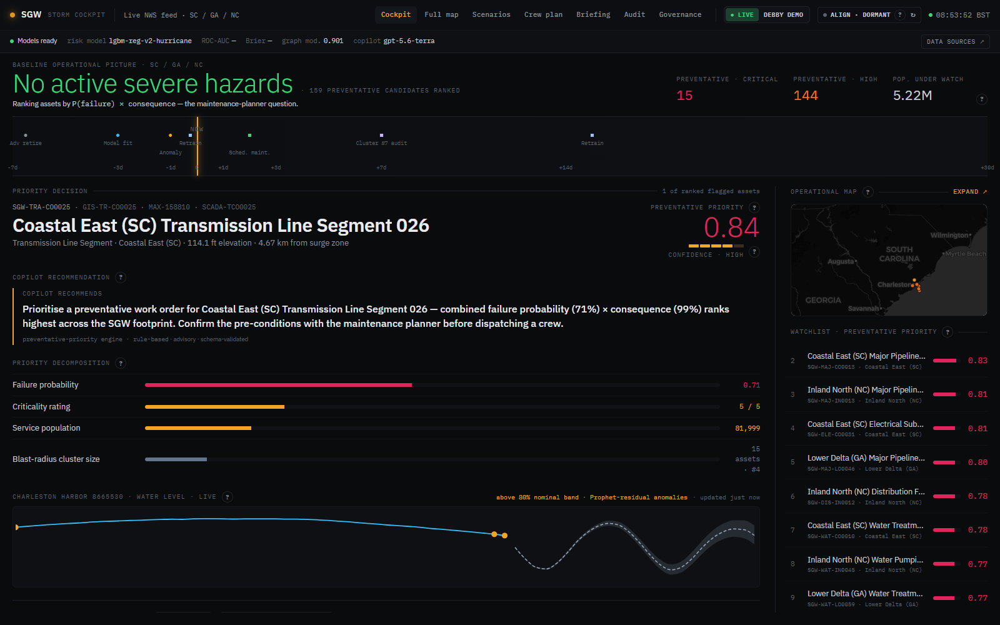
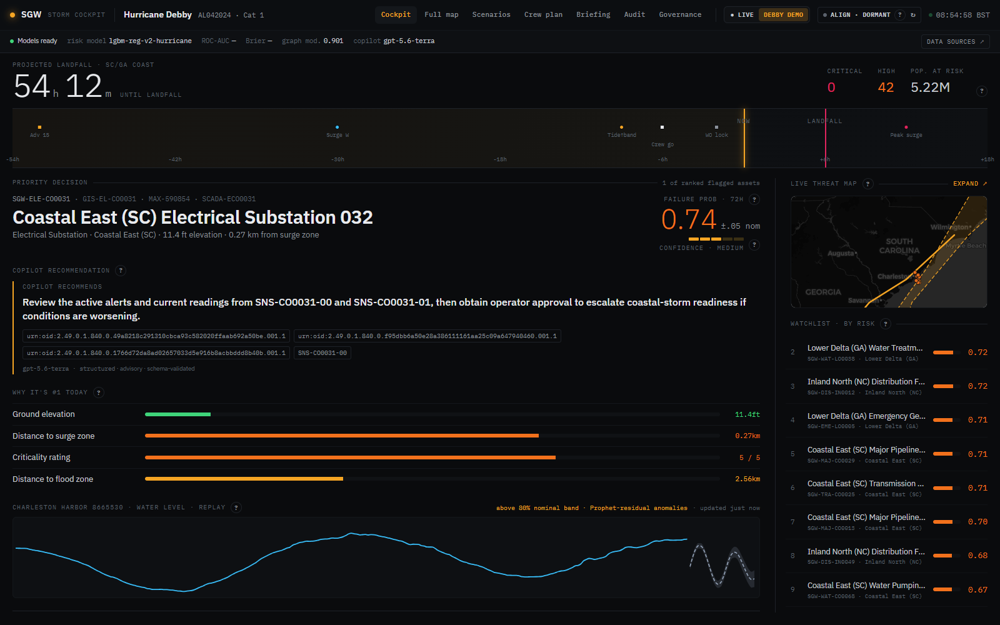
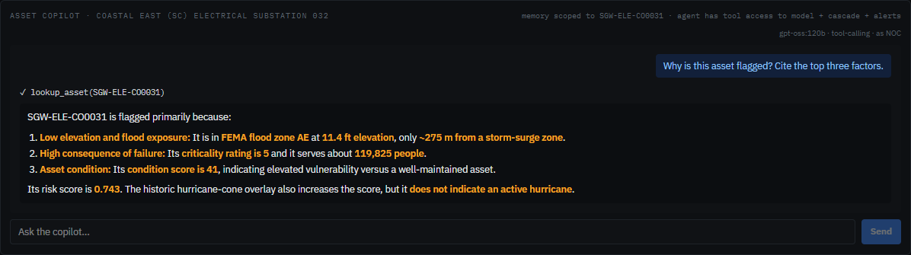
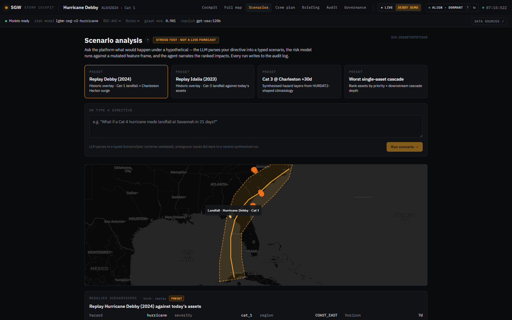
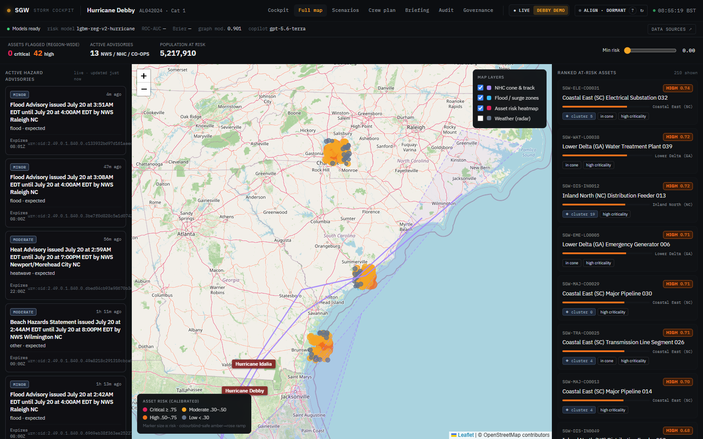
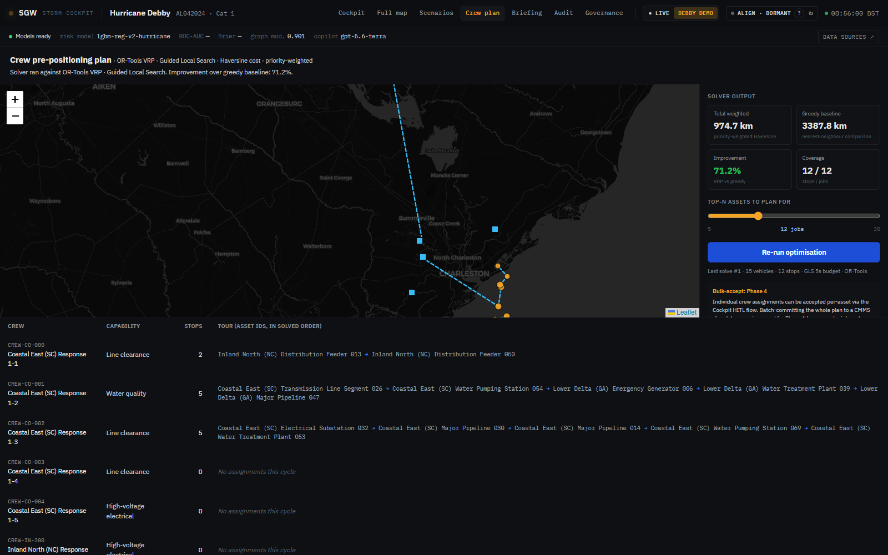
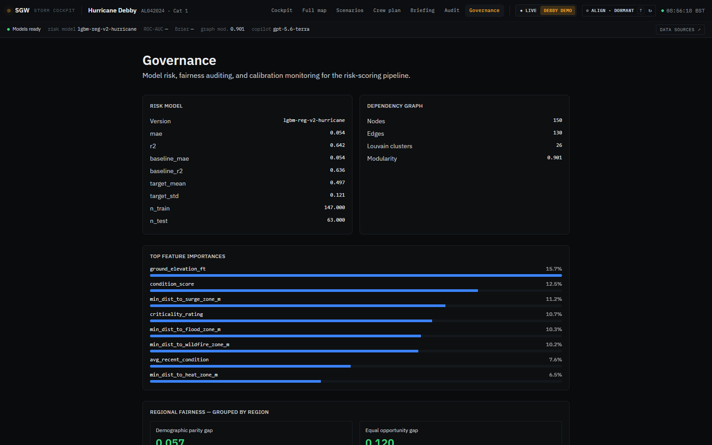
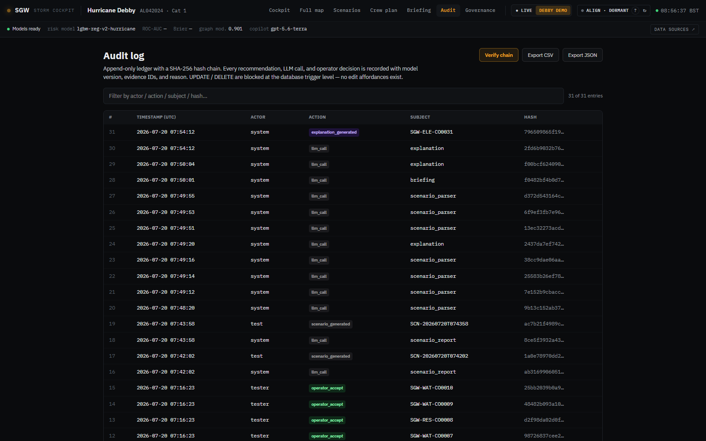
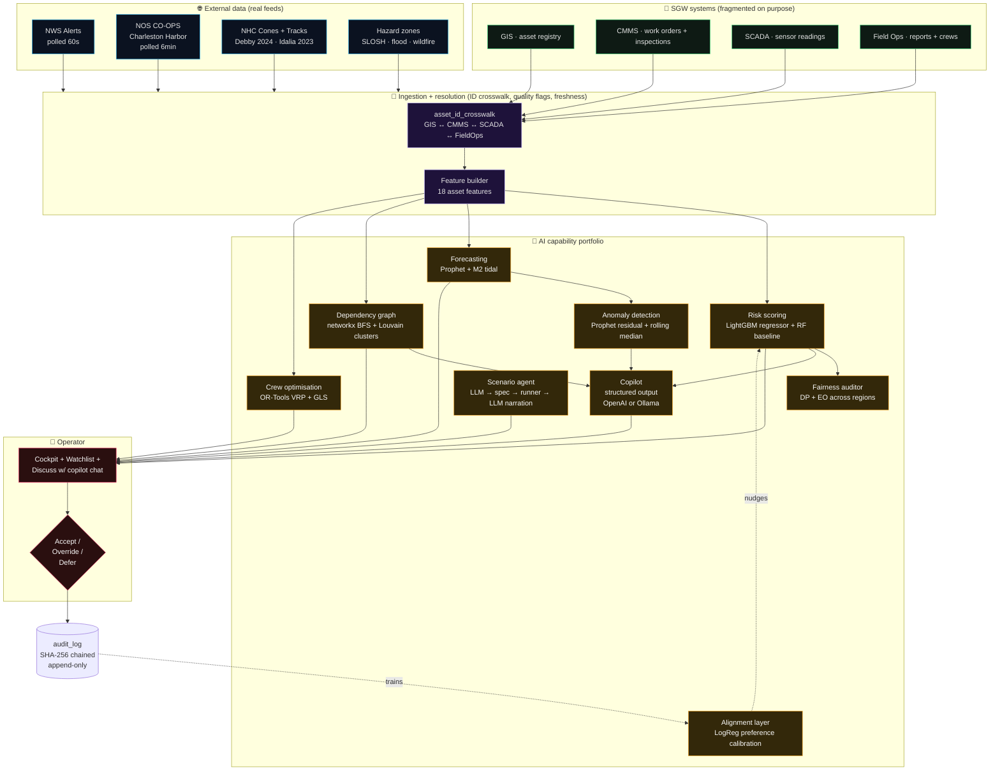
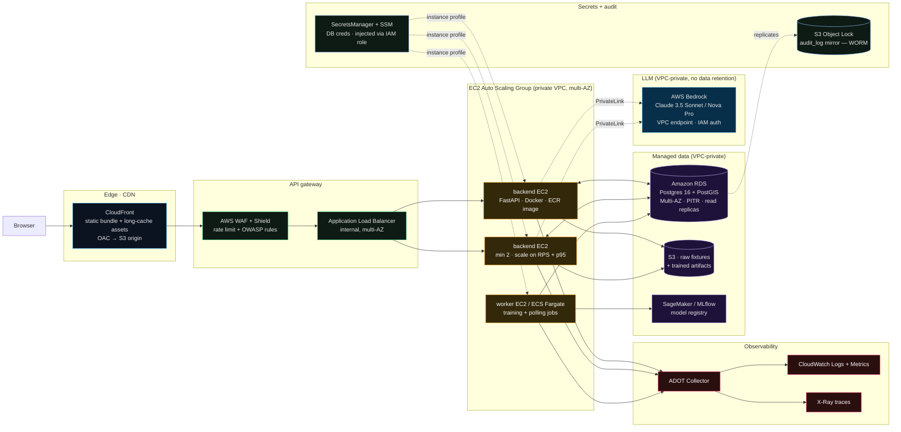

# SGW — Multi-Hazard Readiness & Response

An **AI-enabled operational decision-support prototype** for a fictional US utility, *Southeastern Grid & Water (SGW)*. Built as the AECOM AI Solution Engineer take-home.

> **The LLM is a copilot, not the product.** Risk scores, forecasts, optimisation, and hazard classifications are produced by dedicated ML / OR components (LightGBM, Prophet, OR-Tools, networkx). The LLM narrates, cites source IDs, and explains — never scores. Every recommendation is advisory, with Accept / Override / Defer surfaced in the UI, and an append-only SHA-256-chained audit log behind it.

---

## Run it in one command

Requires **Docker Desktop** and one LLM API key (Ollama Cloud OR OpenAI).

```bash
cp .env.example .env         # fill in OLLAMA_API_KEY (default) or OPENAI_API_KEY
docker compose up --build -d # ~3-4 min first run: builds images, seeds DB, trains models
```

Then open **http://localhost:5173**.

The backend's entrypoint script waits for Postgres, runs migrations, and seeds the mock + NOAA fixtures **only if the database is empty** — so restarts (`docker compose restart`) are near-instant. See [backend/scripts/docker_entrypoint.sh](backend/scripts/docker_entrypoint.sh) for the boot sequence.

Full runbook (native dev, without Docker): [demo/README.md](demo/README.md) · Demo narration script: [demo/walkthrough.md](demo/walkthrough.md).

---

## Deliverables

| # | Deliverable | Where |
|---|---|---|
| 1 | **PRD** for the technical delivery team | [docs/03_prd.md](docs/03_prd.md) |
| 2 | **Executive briefing** | [docs/04_exec_briefing.md](docs/04_exec_briefing.md) |
| 3 | **Prototype + demo video** | Prototype runs via `docker compose`; narration script + storyboard in [demo/walkthrough.md](demo/walkthrough.md) |

---

## Screenshots

Captured against the OpenAI-backed running stack (`LLM_PROVIDER=openai`, `OPENAI_MODEL=gpt-5.6-terra`).

| Surface | Screenshot |
|---|---|
| **Cockpit — LIVE mode** — real NWS alerts + preventative-priority watchlist + operator-alignment nudge on the hero card |  |
| **Cockpit — DEBBY 2024 REPLAY** — same UI conditioned on the historic storm; 54h countdown + timeline spine + real Charleston Harbor surge signal |  |
| **Copilot chat** — asset-scoped, tool-calling, streaming markdown with the actual model (`gpt-5.6-terra`) surfaced in the header |  |
| **Scenarios** — Debby preset with real NHC-shaped storm-path map + ranked impacts |  |
| **Full map** — react-leaflet with hazard-zone + cone + risk-heatmap layers |  |
| **Crew plan** — real OR-Tools VRP solver output (tours, distance, improvement vs greedy baseline) |  |
| **Governance** — risk model + fairness auditor + operator-alignment layer with learned feature weights |  |
| **Audit** — SHA-256 hash-chained ledger with "Verify chain" button |  |

---

## MVP data flow + workflow

The chart below is the platform's end-to-end pipeline. Every arrow is a real code path — grep the labels to find the source.



The dashed arrows are the **preference-learning loop** — every operator decision writes to `audit_log`, the alignment layer retrains every 3 decisions, and its bounded nudge (`|Δ| ≤ 0.15`) updates the ranking on subsequent `/api/assets` calls. Doc: [docs/09_operator_alignment.md](docs/09_operator_alignment.md).

---

## Production deployment architecture

The same architecture at production scale, targeted at **AWS** (native to the utility ops team's existing skill set and audit posture). The demo's Docker Compose stack maps 1:1 to the shaded layers below — each local service has a named AWS equivalent so the transition is a substitution exercise, not a rebuild.



**Why this shape**:

- **EC2 ASG over Kubernetes** — utility ops teams already run VMs; K8s adds a platform layer that needs its own hiring plan and doesn't buy anything on the critical path for a stateless ~10 RPS workload. EC2 + ASG + ALB gives blue/green via CodeDeploy, straightforward AMI lineage for NERC-CIP auditors, and predictable Reserved-Instance / Savings-Plan cost modelling.
- **AWS Bedrock over OpenAI/Ollama** — Bedrock keeps LLM calls inside the VPC via PrivateLink (no traffic over the public internet), doesn't retain prompts for model training (contractual), and authenticates via the EC2 instance-profile IAM role instead of a static API key in `.env`. Available in AWS GovCloud (FedRAMP High / IL5) which lines up with the CIP posture. Claude 3.5 Sonnet on Bedrock has strong structured-output support via the Converse API — the existing `LLMProvider` adapter interface adds a `BedrockProvider` class with the same shape as the OpenAI one.
- **Postgres + PostGIS unchanged** — the prototype already targets Postgres 16 + PostGIS 3.4; RDS is a direct swap-in with Multi-AZ, PITR, and read replicas for the cost of a Terraform module.
- **CloudFront + S3 for the frontend** — the static bundle from the Vite build is CDN-cacheable at the edge; sub-100ms first paint globally with no compute cost.
- **No `.env` in production** — SecretsManager + SSM Parameter Store injected via IAM instance profile. The role assumes-into Bedrock, RDS, and S3 without any static credentials on disk.
- **Audit + WORM** — the SHA-256-chained `audit_log` in RDS is replicated into S3 with Object Lock so regulators get an immutable mirror that the operator role cannot mutate, even by privilege-escalation.

---

## Prototype → production narrative

Everything in the demo is already a step on the production path — nothing is throwaway. Target platform is **AWS**:

- **Same database** — Postgres 16 + PostGIS 3.4. Move to **Amazon RDS** (Multi-AZ, PITR, read replicas); no schema changes needed.
- **Same containers, EC2 not Kubernetes** — the [backend/Dockerfile](backend/Dockerfile) and [frontend/Dockerfile](frontend/Dockerfile) already produce production-shaped images. Backend image lands in **ECR** and deploys via **CodeDeploy** to an **EC2 Auto Scaling Group** behind an internal ALB; frontend static bundle serves from **S3 + CloudFront**. The idempotent seed-on-startup script means an ASG launch is safe to re-run.
- **Same audit contract** — the SHA-256 hash chain runs against the same table; production adds an **S3 Object Lock** write-once mirror that regulators inspect independently.
- **Same LLM adapter pattern, Bedrock in production** — the `LLMProvider` interface already has Ollama Cloud and OpenAI adapters. Production adds a `BedrockProvider` of identical shape, calling `bedrock-runtime` via a **VPC endpoint (PrivateLink)** so LLM traffic never leaves the VPC. Recommended model: **Claude 3.5 Sonnet on Bedrock** (no prompt retention, GovCloud-eligible). Provider swap is `LLM_PROVIDER=bedrock`.
- **Same eval suite** — the `tests/evals/` model-quality + LLM-golden tests run as a CI gate via **CodePipeline + CodeBuild**; production adds continuous evaluation against production traffic samples.
- **Secrets managed differently** — `.env` today, **SecretsManager + SSM Parameter Store** in production, injected via the **EC2 instance-profile IAM role**. Bedrock authenticates by IAM — no LLM API key on disk. Same env-var names; the delta is one Terraform module.
- **Observability hooks are already emitted** — structlog JSON logs + Prometheus metrics counters exist in the code; production adds an **ADOT Collector → CloudWatch + X-Ray** receiver so the ops team uses the same dashboards as the rest of the AWS estate.

The one genuinely new workstream in production is real data ingestion: replacing the deterministic mock generator with adapters against SGW's real GIS/CMMS/SCADA. That's a Phase-1 delivery, not an unknown. See [docs/05_architecture.md](docs/05_architecture.md) §7 for the sequenced rollout.

---

## Future developments (post-MVP roadmap)

Concrete next moves, prioritised by expected impact:

1. **Real historical failure labels** — replace the synthetic training label with joins to SGW's incident history. Unlocks classification + real probability calibration (the current ±0.05 band becomes a real per-prediction CI).
2. **LLM-classified defer reasons feed the alignment layer** — reason text is already captured; run it through a structured-output bucketing prompt (`already_inspected` / `cost_prohibitive` / `seasonal` / `not_critical` / `other`) and one-hot into the alignment features. The layer moves from "operator prefers this shape of asset" to "operator prefers this shape of asset *for this reason*".
3. **Per-operator alignment models** — replace the single global preference model with a per-operator model (or per-persona: NOC / Emergency / Field / Maintenance). Prevents one operator's judgement from dominating another's.
4. **Local SHAP attributions** — today the driver bars use global feature importance × per-asset feature values. SHAP gives the mathematically-correct per-asset attribution and unlocks *"why THIS asset scored this way"* rather than *"which features matter across all assets"*.
5. **Real-time CMMS write-back** — Accept currently writes to `audit_log`; add a Maximo / ServiceNow adapter so accepted recommendations become dispatched work orders on the operator's real queue.
6. **Multi-hazard risk fusion** — one model per hazard today (hurricane, flood, heatwave, wildfire). Consolidate to a hazard-conditional multi-target model so a compound event (hurricane + flooding + heat) doesn't require running three models independently.
7. **Deep-sequence forecasting where Prophet plateaus** — GRU / TFT for higher-dimensional time-series signals (aggregate demand curves, multi-gauge fusion). Keep Prophet for the simple, interpretable single-gauge story.

---

## Repo tour

- **[PLAN.md](PLAN.md)** — phase-gated execution plan with tests at every stage
- **[Makefile](Makefile)** — common commands: `make install`, `make dev`, `make test`, `make demo`
- **[.env.example](.env.example)** — copy to `.env` and fill in credentials
- **[backend/](backend/)** — Python 3.12 · FastAPI · SQLAlchemy 2.x async · Alembic · uv
- **[frontend/](frontend/)** — React 19 · TypeScript strict · Vite · Tailwind · react-markdown · react-leaflet · Zustand
- **[data/](data/)** — fragmented mock fixtures (per-source formats, per-system IDs, quality flags — ingestion is a first-class capability). Baked into the backend image for the docker path.
- **[infra/](infra/)** — Postgres init + optional Prometheus/Grafana profile
- **[demo/](demo/)** — walkthrough, narration script, screenshots, scenarios
- **[docker-compose.yml](docker-compose.yml)** · **[backend/Dockerfile](backend/Dockerfile)** · **[frontend/Dockerfile](frontend/Dockerfile)** · **[frontend/nginx.conf](frontend/nginx.conf)** — one-command stack

## Design docs (read in this order)

- [docs/01_assumptions.md](docs/01_assumptions.md) — explicit assumptions register (each with an *if wrong* clause)
- [docs/02_mvp_workflow.md](docs/02_mvp_workflow.md) — MVP workflow selection + alternatives considered
- [docs/03_prd.md](docs/03_prd.md) — full PRD v1.0 (Deliverable 1)
- [docs/04_exec_briefing.md](docs/04_exec_briefing.md) — executive briefing (Deliverable 2)
- [docs/05_architecture.md](docs/05_architecture.md) — prototype + production architecture
- [docs/06_data_model.md](docs/06_data_model.md) — mock dataset spec (fragmented on purpose)
- [docs/07_external_data_sources.md](docs/07_external_data_sources.md) — NOAA source registry
- [docs/08_scenario_agent.md](docs/08_scenario_agent.md) — scenario agent internals
- [docs/09_operator_alignment.md](docs/09_operator_alignment.md) — preference learning (not RL) explainer
- [docs/10_mock_data_defensibility.md](docs/10_mock_data_defensibility.md) — mock data health check

Build-process artifacts (working notes, mid-build design pivots, UI self-audit) are kept in [docs/internal/](docs/internal/) for auditability but are not part of the deliverable set.

## Guiding principles

- **One coherent MVP workflow** — Multi-Hazard Readiness & Response — reused across PRD, exec briefing, prototype, demo
- **Hazard-conditional AI**, not one-off models — same platform reasons across four hazards
- **Fragmentation-by-design in the mock** — the ingestion + ID-resolution layer is a first-class capability
- **AI beyond LLMs** — forecasting, anomaly detection, optimisation, predictive ML are first-class; the LLM narrates and explains, never produces the risk score
- **Users are SGW operational staff**, not the 8M residents (residents are beneficiaries)
- **Credible path from prototype → production**, not a production build — see the deployment diagram above

## Test suite pointers

- `make test-backend` — 42 tests (unit + integration + evals). Includes alignment invariants, Prophet coverage, risk-model fit, chain integrity.
- `make test-frontend` — 32 tests (Vitest + RTL) covering app shell, ExplainPopover catalog, ScenariosPage.
- Playwright end-to-end smoke tests were run against the built stack during development; findings + fixes are captured in [docs/internal/12_demo_ui_audit.md](docs/internal/12_demo_ui_audit.md).

## LLM engineering discipline

The platform's LLM layer is built the same way the rest of the code is — with **versions, evals, and an audit trail**.

- **Every LLM call writes to `audit_log`** with `action_type=llm_call` and a row for `(provider, model, prompt_version, prompt_hash, outcome)`. Filter by `(prompt_version)` to isolate a regression.
- **Prompts are versioned** — [backend/src/sgw_platform/explain/prompt_versions.py](backend/src/sgw_platform/explain/prompt_versions.py) — with a short changelog per bump. Current registry: `GET /api/llm/prompts`.
- **Golden-set eval** — [backend/tests/evals/test_llm_golden.py](backend/tests/evals/test_llm_golden.py) hits the real LLM with pinned prompts and asserts on schema stability + anti-hallucination invariants (every cited evidence ID must appear in the prompt).
- **Provider swap is one env var** — `LLM_PROVIDER=openai` or `LLM_PROVIDER=ollama`, no code changes. The OpenAI provider auto-detects reasoning models (o1/o3/o4/gpt-5.x) and adjusts `temperature` + `reasoning_effort` accordingly, and post-processes Pydantic JSON schemas into OpenAI strict-mode form.

## AI-assisted development, also as engineering

This repo was built with AI assistance. It's included in the submission for auditability — see **[.claude/README.md](.claude/README.md)** for the framing:

- **[.claude/agents/](.claude/agents/)** — three task-scoped subagents (`test-orchestrator`, `dev-tracker`, `demo-scribe`), each with defined tool policies and non-goals. Same pattern as the platform's copilot.

## Notes for reviewers

- Docker path is the fastest route to a working stack; native `make dev-*` is documented in [demo/README.md](demo/README.md) if Docker Desktop isn't available.
- NOAA data is redistributed under NOAA's open-data policy; only small clipped WGS84 fixtures are committed.
