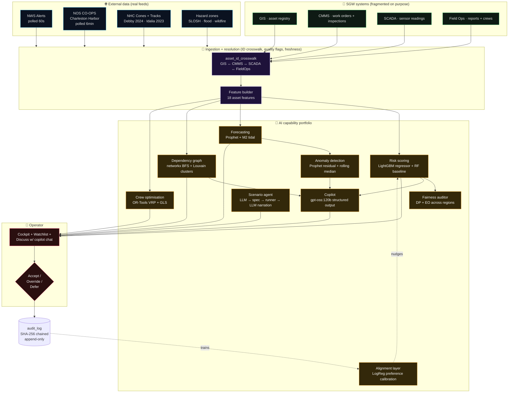
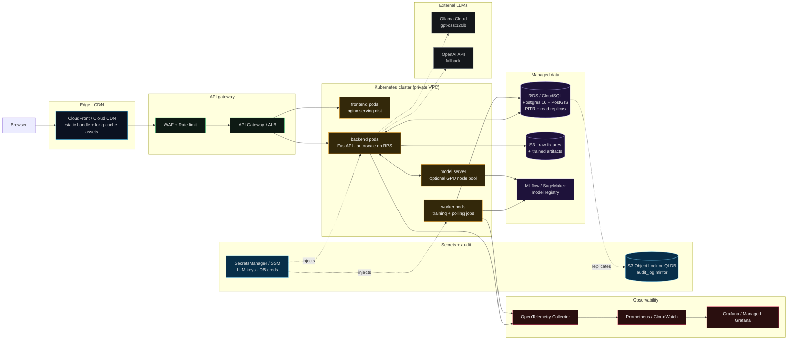

# SGW — Multi-Hazard Readiness & Response

An **AI-enabled operational decision-support prototype** for a fictional US utility, *Southeastern Grid & Water (SGW)*. Built as the AECOM AI Solution Engineer take-home.

> **The LLM is a copilot, not the product.** Risk scores, forecasts, optimisation, and hazard classifications are produced by dedicated ML / OR components (LightGBM, Prophet, OR-Tools, networkx). The LLM narrates, cites source IDs, and explains — never scores. Every recommendation is advisory, with Accept / Override / Defer surfaced in the UI, and an append-only SHA-256-chained audit log behind it.

---

## Run it in one command

Requires **Docker Desktop** and one LLM API key (Ollama Cloud OR OpenAI).

```bash
cp .env.example .env         # fill in OLLAMA_API_KEY (default) or OPENAI_API_KEY
docker compose up --build -d # ~3-4 min first run: builds images, seeds DB, trains models
```

Then open **http://localhost:5173**.

The backend's entrypoint script waits for Postgres, runs migrations, and seeds the mock + NOAA fixtures **only if the database is empty** — so restarts (`docker compose restart`) are near-instant. See [backend/scripts/docker_entrypoint.sh](backend/scripts/docker_entrypoint.sh) for the boot sequence.

Full runbook (native dev, without Docker): [demo/README.md](demo/README.md) · Demo narration script: [demo/walkthrough.md](demo/walkthrough.md).

---

## Deliverables

| # | Deliverable | Where |
|---|---|---|
| 1 | **PRD** for the technical delivery team | [docs/04_prd.md](docs/04_prd.md) |
| 2 | **Executive briefing** | [docs/05_exec_briefing.md](docs/05_exec_briefing.md) |
| 3 | **Prototype + demo video** | Prototype runs via `docker compose`; narration script + storyboard in [demo/walkthrough.md](demo/walkthrough.md) |

---

## MVP data flow + workflow

The chart below is the platform's end-to-end pipeline. Every arrow is a real code path — grep the labels to find the source.



The dashed arrows are the **preference-learning loop** — every operator decision writes to `audit_log`, the alignment layer retrains every 3 decisions, and its bounded nudge (`|Δ| ≤ 0.15`) updates the ranking on subsequent `/api/assets` calls. Doc: [docs/13_operator_alignment.md](docs/13_operator_alignment.md).

---

## Production deployment architecture

The same architecture at production scale. The demo's Docker Compose stack maps 1:1 to the shaded layers below — each local service has a named cloud equivalent so the transition is a substitution exercise, not a rebuild.



**Why this shape**: Postgres + PostGIS is already the prototype's source-of-truth, so a managed equivalent (RDS / CloudSQL / AlloyDB) needs no schema changes and gains PITR, replicas, and NERC-CIP-friendly encryption for free. The backend is stateless behind an ALB, autoscaling on request rate — trained model artifacts live in S3/MLflow rather than in-process, so pods are interchangeable. The static frontend behind CloudFront gives sub-100ms first paint globally with no compute cost. Secrets never live in `.env` in production — SecretsManager / SSM injects them via K8s CSI driver, and the SHA-256-chained `audit_log` is mirrored into a write-once store (S3 Object Lock or QLDB) so regulators get their own copy that the operator cannot mutate.

---

## Prototype → production narrative

Everything in the demo is already a step on the production path — nothing is throwaway:

- **Same database** — Postgres 16 + PostGIS 3.4. Move to managed (RDS / CloudSQL / AlloyDB); no schema changes needed.
- **Same containers** — the [backend/Dockerfile](backend/Dockerfile) and [frontend/Dockerfile](frontend/Dockerfile) already produce production-shaped images (multi-stage frontend build → nginx; backend with idempotent seed-on-startup for K8s Job compatibility).
- **Same audit contract** — the SHA-256 hash chain runs against the same table; the production shape adds a write-once mirror (S3 Object Lock or QLDB) that regulators can inspect independently.
- **Same LLM adapter pattern** — Ollama Cloud today, OpenAI as fallback, other providers behind the same `LLMProvider` interface. Zero code changes to swap.
- **Same eval suite** — the `tests/evals/` model-quality tests run as a CI gate; production adds continuous evaluation against production traffic samples.
- **Secrets managed differently** — `.env` today, SecretsManager/SSM in production. Same env-var names; the delta is one Helm value.
- **Observability hooks are already emitted** — structlog JSON logs + Prometheus metrics counters exist in the code; production just adds a receiver (OpenTelemetry Collector → Prometheus + Grafana + Loki).

The one genuinely new workstream in production is real data ingestion: replacing the deterministic mock generator with adapters against SGW's real GIS/CMMS/SCADA. That's a Phase-1 delivery, not an unknown. See [docs/06_architecture.md](docs/06_architecture.md) §7 for the sequenced rollout.

---

## Future developments (post-MVP roadmap)

Concrete next moves, prioritised by expected impact:

1. **Real historical failure labels** — replace the synthetic training label with joins to SGW's incident history. Unlocks classification + real probability calibration (the current ±0.05 band becomes a real per-prediction CI).
2. **LLM-classified defer reasons feed the alignment layer** — reason text is already captured; run it through a gpt-oss:120b bucketing prompt (`already_inspected` / `cost_prohibitive` / `seasonal` / `not_critical` / `other`) and one-hot into the alignment features. The layer moves from "operator prefers this shape of asset" to "operator prefers this shape of asset *for this reason*".
3. **Per-operator alignment models** — replace the single global preference model with a per-operator model (or per-persona: NOC / Emergency / Field / Maintenance). Prevents one operator's judgement from dominating another's.
4. **Local SHAP attributions** — today the driver bars use global feature importance × per-asset feature values. SHAP gives the mathematically-correct per-asset attribution and unlocks *"why THIS asset scored this way"* rather than *"which features matter across all assets"*.
5. **Real-time CMMS write-back** — Accept currently writes to `audit_log`; add a Maximo / ServiceNow adapter so accepted recommendations become dispatched work orders on the operator's real queue.
6. **Multi-hazard risk fusion** — one model per hazard today (hurricane, flood, heatwave, wildfire). Consolidate to a hazard-conditional multi-target model so a compound event (hurricane + flooding + heat) doesn't require running three models independently.
7. **Deep-sequence forecasting where Prophet plateaus** — GRU / TFT for higher-dimensional time-series signals (aggregate demand curves, multi-gauge fusion). Keep Prophet for the simple, interpretable single-gauge story.

---

## Repo tour

- **[CLAUDE.md](CLAUDE.md)** — project instructions, guardrails, stack, conventions
- **[PLAN.md](PLAN.md)** — phase-gated execution plan with tests at every stage
- **[Makefile](Makefile)** — common commands: `make install`, `make dev`, `make test`, `make demo`
- **[.env.example](.env.example)** — copy to `.env` and fill in credentials
- **[backend/](backend/)** — Python 3.12 · FastAPI · SQLAlchemy 2.x async · Alembic · uv
- **[frontend/](frontend/)** — React 19 · TypeScript strict · Vite · Tailwind · react-markdown · react-leaflet · Zustand
- **[data/](data/)** — fragmented mock fixtures (per-source formats, per-system IDs, quality flags — ingestion is a first-class capability). Baked into the backend image for the docker path.
- **[infra/](infra/)** — Postgres init + optional Prometheus/Grafana profile
- **[demo/](demo/)** — walkthrough, narration script, screenshots, scenarios
- **[docker-compose.yml](docker-compose.yml)** · **[backend/Dockerfile](backend/Dockerfile)** · **[frontend/Dockerfile](frontend/Dockerfile)** · **[frontend/nginx.conf](frontend/nginx.conf)** — one-command stack

## Design docs (read in this order)

- [docs/00_working_notes.md](docs/00_working_notes.md) — running scratchpad + decision log
- [docs/01_assumptions.md](docs/01_assumptions.md) — explicit assumptions register
- [docs/02_mvp_workflow.md](docs/02_mvp_workflow.md) — MVP workflow selection + alternatives considered
- [docs/04_prd.md](docs/04_prd.md) — full PRD v1.0
- [docs/05_exec_briefing.md](docs/05_exec_briefing.md) — leadership brief
- [docs/06_architecture.md](docs/06_architecture.md) — prototype + production architecture
- [docs/07_data_model.md](docs/07_data_model.md) — mock dataset spec (fragmented on purpose)
- [docs/08_external_data_sources.md](docs/08_external_data_sources.md) — NOAA source registry
- [docs/11_scenario_agent.md](docs/11_scenario_agent.md) — scenario agent internals
- [docs/13_operator_alignment.md](docs/13_operator_alignment.md) — preference learning (not RL) explainer
- [docs/14_mock_data_defensibility.md](docs/14_mock_data_defensibility.md) — data health check

## Guiding principles

- **One coherent MVP workflow** — Multi-Hazard Readiness & Response — reused across PRD, exec briefing, prototype, demo
- **Hazard-conditional AI**, not one-off models — same platform reasons across four hazards
- **Fragmentation-by-design in the mock** — the ingestion + ID-resolution layer is a first-class capability
- **AI beyond LLMs** — forecasting, anomaly detection, optimisation, predictive ML are first-class; the LLM narrates and explains, never produces the risk score
- **Users are SGW operational staff**, not the 8M residents (residents are beneficiaries)
- **Credible path from prototype → production**, not a production build — see the deployment diagram above

## Test suite pointers

- `make test-backend` — 42 tests (unit + integration + evals). Includes alignment invariants, Prophet coverage, risk-model fit, chain integrity.
- `make test-frontend` — 32 tests (Vitest + RTL) covering app shell, ExplainPopover catalog, ScenariosPage.
- Playwright e2e smoke tests documented in [docs/12_demo_ui_audit.md](docs/12_demo_ui_audit.md).

## Notes for reviewers

- Docker path is the fastest route to a working stack; native `make dev-*` is documented in [demo/README.md](demo/README.md) if Docker Desktop isn't available.
- NOAA data is redistributed under NOAA's open-data policy; only small clipped WGS84 fixtures are committed.
- The `.claude/agents/` subagents and [CLAUDE.md](CLAUDE.md) are included to make the AI-assisted build methodology inspectable.
